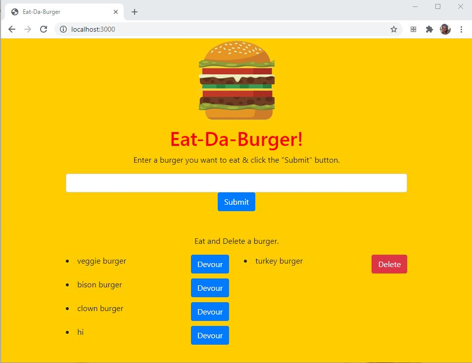
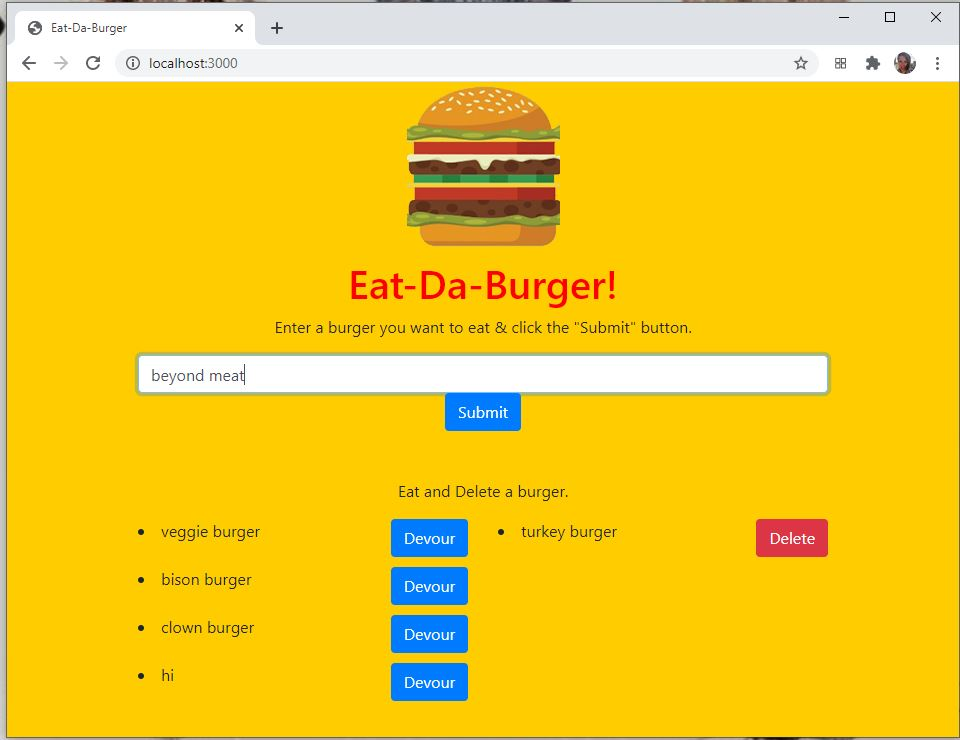
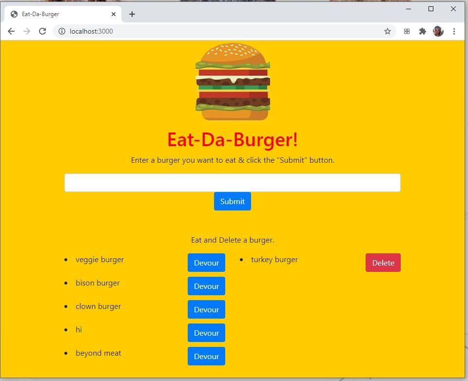
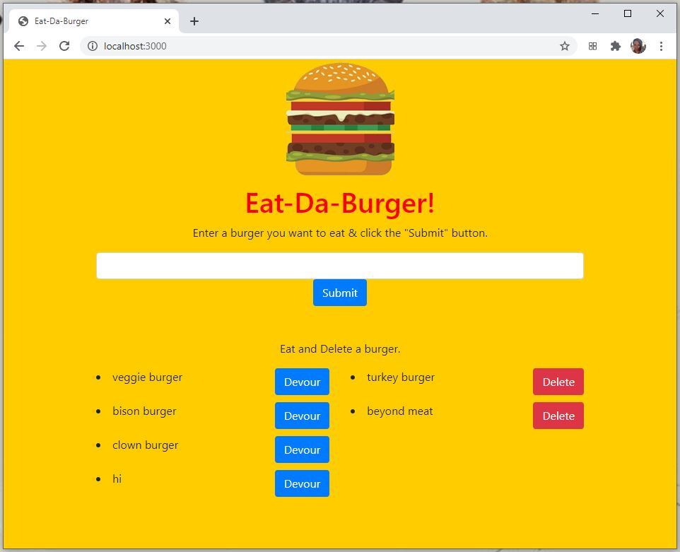
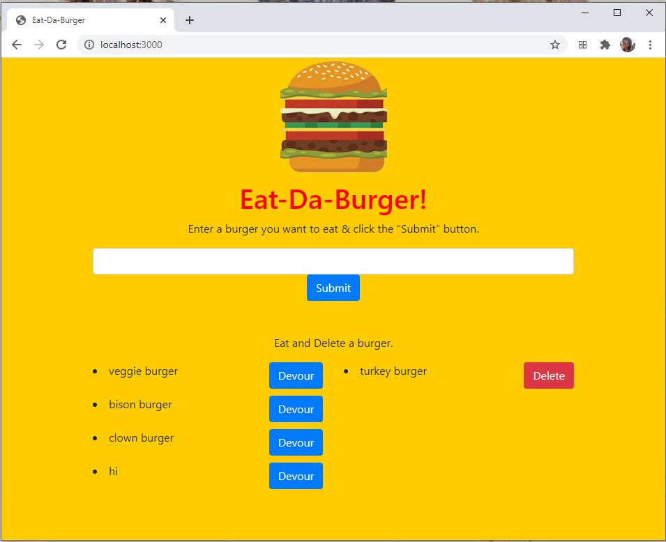

# voulezvousfromage 

# Table of contents
1. [Description](#Description)
2. [Installation instructions](#Installation-instructions)
3. [Usage](#usage)
4. [Contributions](#Contributions)
5. [Testing instructions](#Testing-instructions)
6. [License](#License)
7. [Questions](#Questions)

## Description and images of the project: 
This application is designed for restaurants to keep track of custom burger orders. Users can enter the type of burger they want, and it will appear on the screen. Once the user has consumed the burger, he or she can then click the "Devour" button, which will move the entry to the "To delete" section. Users can then delete their burger.

When the user arrives he or she is greeted with the following screen:

They can then enter a burger order, as shown here:

The burger will appear on the screen:

The user can move the order to the delete section:

They can then delete the entry:

## Installation instructions: 
Users should install express and mysql.

## Usage: 
This project is designed for restaurants to keep track of custom burger orders.

## Contributions: 
This is currently a solo project for skolnikskolnik.

## Testing instructions: 
Users can run the application locally in a web browser or they can use postman.

## License:  
This project is covered under the MIT License license.

## Questions
Visit my <a href='https://www.github.com/skolnikskolnik'>github page.</a> 

Email me at jtskolnik@gmail.com with any additional questions you may have. I am always happy to talk to users of my product!